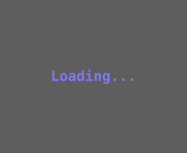
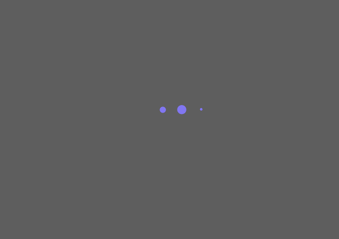
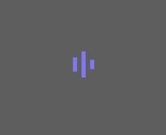
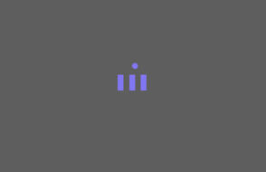
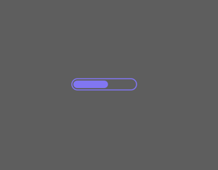
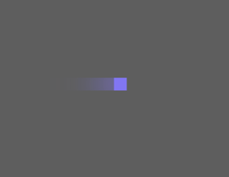
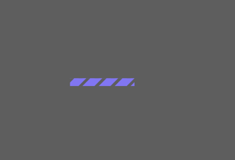
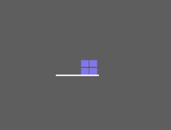

# Vuetify3 Vue3 fullscreen loading

This module extends vuetify3 loading.


## Setup

Install the package from npm

```npm
npm install vuetify3-loading
```

```npm
yarn add vuetify3-loading
```


## vuetify 3

```javascript
import "vuetify3-loading/dist/style.css"
import loading from "vuetify3-loading"
app.use(loading,{loader:'classical'})
```
....
### loader values
* rotate

    


* classical
    
    


* dot
    
    


* bar
    
    


* dot-bar

    


* spinner
  
    

  
* progress
  
    


* wobbling
    
    

  
* infinity
  
    

  
* eye

    


* factory

    

## Usage

```js
this.$loading.show()

this.$loading.hide()
```

```js
import {getCurrentInstance, ref} from 'vue'
const {proxy} = getCurrentInstance()
proxy.$loading.show()
proxy.$loading.hide()
```
